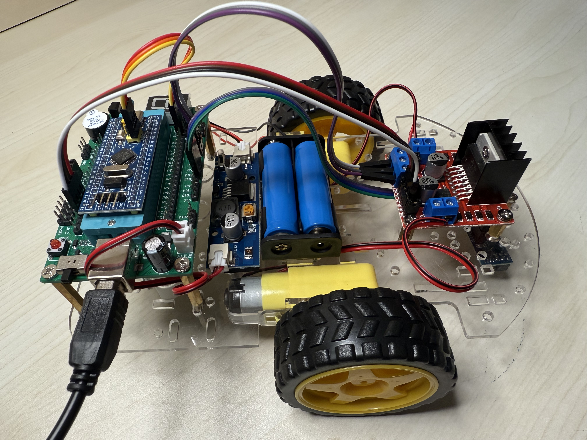

# project

暑期培训的小车项目，用的 STM32F103C8T6。

硬件：
- STM32F103C8T6
- L298N 电机驱动
- 两个直流减速电机
- RPR220 循迹传感器 x2
- 七段数码管
- 18650 电池

## 进度

### Task 1
建了 github 仓库

### Task 2
数码管从 0 开始每秒加 1，到 9 归零，一直循环

### Task 3
L298N 驱动两个电机正转，按按键切换反转

### Task 4
测 RPR220 传感器，黑线和白地输出不一样，数码管显示状态

### Task 5
小车装好了

### Task 6
按按键小车前进，再按停止

### Task 7
循迹

### Task 8
S 弯

### Task 9
循迹加了 PID，跑得稳一点，抖得没以前厉害

代码都在 code 文件夹里，task9_project 是循迹最终版。
